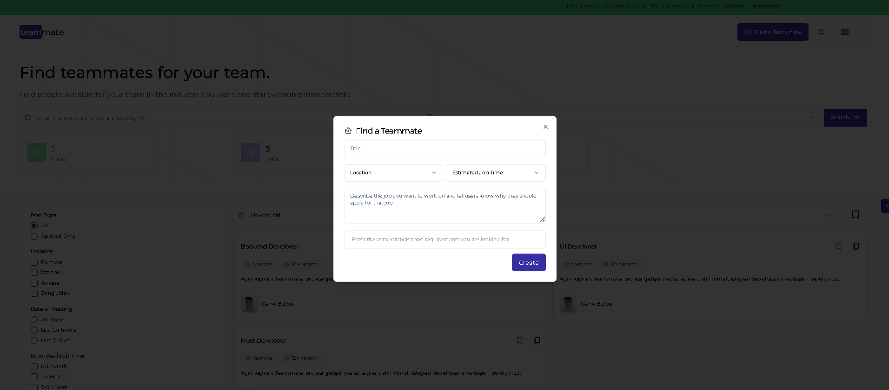

# Teammate

"Teammate" allows you to find new teammates for your team. Log in, open an ad, enter the estimated job duration and get people who like your project idea to join you.

**! The target audience is students and similar people who have a project idea but have difficulty finding a teammate. Those who have commercial expectations and want to use people for free should please turn to other platforms**

## Language Support

- Turkish
- English
- Azerbaijani

## Screenshots

  <div >
    
    <p>Home</p>
  </div>

  <div>
    
    <p>Job Sheet</p>
  </div>

  <div>
    
    <p>Create an ad</p>
  </div>

  <div>
    
    <p>Settings Page</p>
  </div>

  <div>
    
    <p>MyJobs Sheet</p>
  </div>

   <div>
    
    <p>Login Page</p>
  </div>

   <div>
    
    <p>Signup Page</p>
  </div>

   <div>
    
    <p>Confirmation Page</p>
  </div>

## Environment Variables

To run this project you will need to add the following environment variables to your .env file

`NUXT_BASE_URL`

`GOOGLE_CLIENT_ID` -> For google signin/signup

`GOOGLE_CLIENT_SECRET` -> For google signin/signup

`MONGODB_URI`

`NUXT_SMTP_USER` -> For sending e-mail

`NUXT_SMTP_PASS` -> For sending e-mail

#### For Firebase Storage

`firebaseApiKey`

`firebaseAuthDomain`

`firebaseProjectId`

`firebaseStorageBucket`

`firebaseMessagingSenderId`

`firebaseAppId`

## Nuxt 3 Minimal Starter

Look at the [Nuxt 3 documentation](https://nuxt.com/docs/getting-started/introduction) to learn more.

### Setup

Make sure to install the dependencies:

```bash
# npm
npm install

# pnpm
pnpm install

# yarn
yarn install

# bun
bun install
```

### Development Server

Start the development server on `http://localhost:3000`:

```bash
# npm
npm run dev

# pnpm
pnpm run dev

# yarn
yarn dev

# bun
bun run dev
```

### Production

Build the application for production:

```bash
# npm
npm run build

# pnpm
pnpm run build

# yarn
yarn build

# bun
bun run build
```

Locally preview production build:

```bash
# npm
npm run preview

# pnpm
pnpm run preview

# yarn
yarn preview

# bun
bun run preview
```

Check out the [deployment documentation](https://nuxt.com/docs/getting-started/deployment) for more information.

## Technologies Used

**Main:** Nuxt Js, Typescript, Tailwind Css, Scss, ShadcnVue, MongoDB, Pinia, Firebase Storage

**Packages:** nuxt-mongoose, nuxtjs/i18n, nuxtjs/google-fonts, dropzone, bcrypt, uuid, vee-validate, zod, sidebase-auth, nodemailer, nuxt-marquee

## Authors and Acknowledgments

- [@cenkbulbull](https://github.com/cenkbulbull) development

## Contribution

Contributions are always welcome!

Getting started See `Contributor.md'.

Please follow this project's 'code of conduct'.

## Feedback

If you have any feedback, please contact us at cenkbulbul67@gmail.com.
